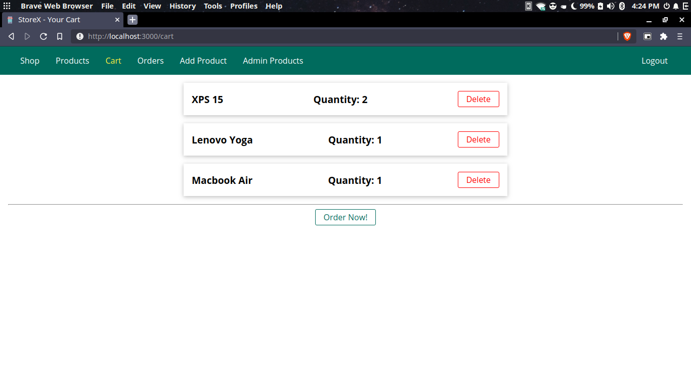

# storeX

a simple shop app devloped using nodejs (javascript) MVC, ejs templating engine, mongoDB and many other technologies.

**PS:** though it is a small demo this app applies all good security measures and best practices and is for what it's worth "feature complete".

# Screenshots

## main page

## adding a product

## cart

## admin page

## login page

